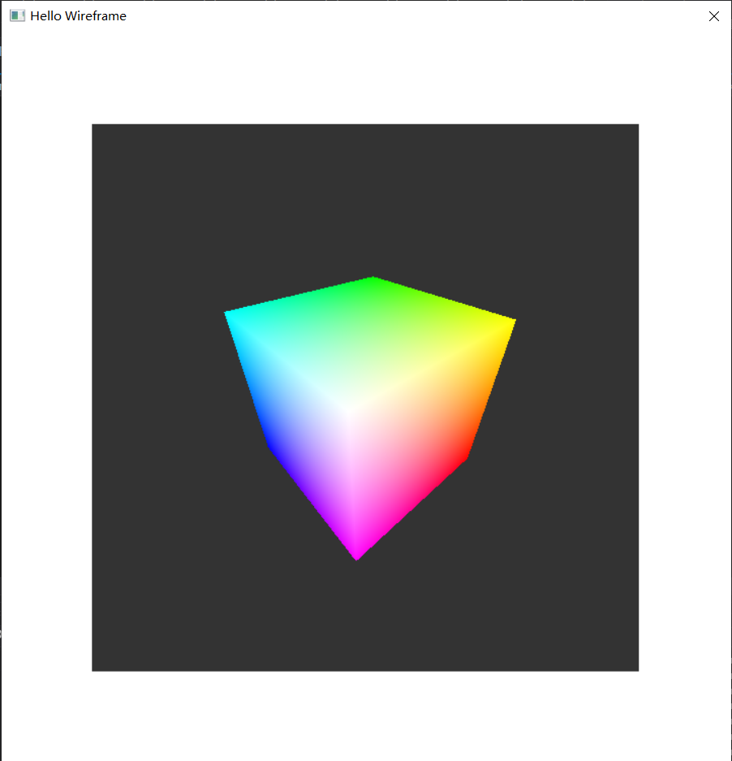
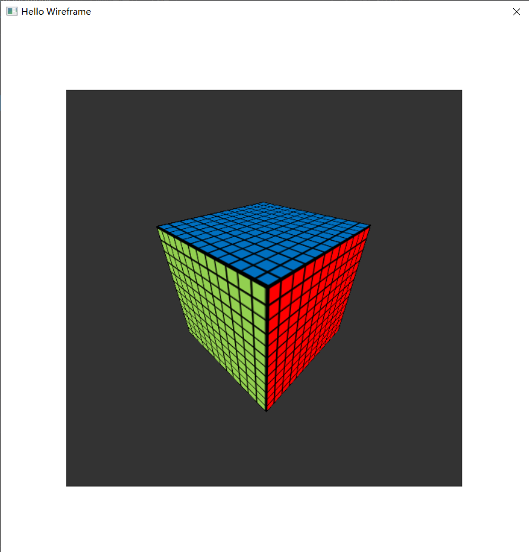
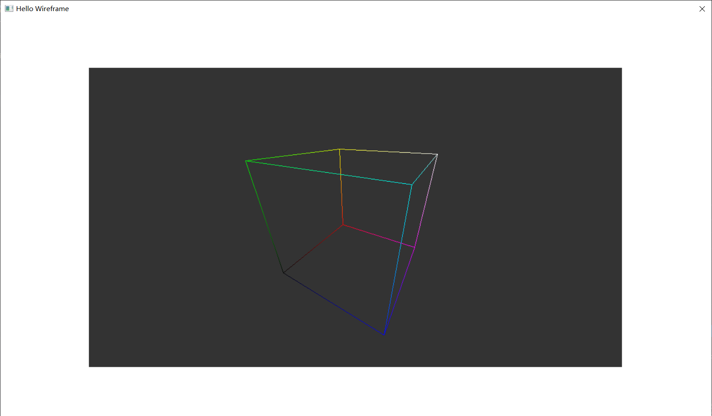

# Mini3D with LibGraphics

本企划旨在让笔者本人摸清楚**基本的三维光栅化（Rasterization）**图形渲染流程，同时~~帮你卷赢C大程~~。

由于众所周知的原因，C大程很多任课老师来自**CAD&CG国家重点实验室**，做一个具有三维渲染功能的大程是比较讨喜的选择。笔者搜了一圈GitHub，没有找到适配**LibGraphics**的**软光栅化渲染库**，因此决定自己实现一个，权当练习与科普。

库的接口封装风格将参考OpenGL。文档建议使用**Typora**阅读（主要是因为文档有很多LaTex格式的数学公式）。由于最新的**Typora**已经转型收费软件，可以下载[Typora for windows — beta version release](https://typora.io/windows/dev_release.html)的0.11.18版本（免费）。

## 已完成

- 线元绘制
- 面元绘制（绘制颜色或纹理）
  - 最近邻采样
  - 双线性插值采样
- 关于LibGraphics的文档

## 待完成

- 点元绘制
- OBJ模型导入
- 光照
- 文档
- ......

## 效果图

| 面绘制                             | 面绘制（有纹理）                           |
| ---------------------------------- | ------------------------------------------ |
|  |  |

| 线框绘制                                |
| --------------------------------------- |
|  |

## 章节

- [环境配置 与 LibGraphics](./doc/HelloLibGraphics.md)（选读）
  - 主要讲述一些VS 2019运行LibGraphics的坑，使用VS 2010或DevC++的朋友可以忽略此章节。
  - 想看Debug思路的朋友也可以读一读。
- [魔改一下LibGraphics——避免闪烁](./doc/ModifyLibGraphics-NoBlink.md)
  - 讲述Win32事件（消息）循环与绘制流程。
  - 修改Win32事件（消息）循环避免动画闪烁问题。
- [魔改一下LibGraphics——操作像素](./doc/ModifyLibGraphics-Pixel.md)

- 三维渲染流程中的数学——坐标系统 与 矩阵运算
- 三维渲染流程中的数学——算法

