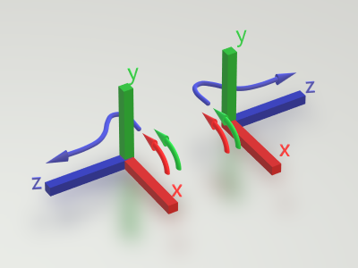
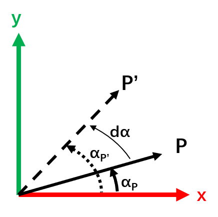

# 坐标系统 与 矩阵运算

[toc]

需要用到**LibGraphics**写C大程项目，相信你一定已经学完~~并忘掉~~**线性代数**了。

不过没关系，本项目用到的数学知识特别简单，将全部在下文讲完。三维图形算法中一般只用到 $4\cross3$ 或 $4\cross4$ 的矩阵，以及 $4\cross1$ 或 $3\cross1$ 的向量，所以下文的论述和算法都不会超过这个范围。

## 左右手系 与 矩阵、向量的计算机表示

在本项目中，将统一使用**右手坐标系**和**行主序表示**。

- 下图中，左边为**右手系**，右边为**左手系**。
  - 弯曲箭头表示使用**右手**或**左手**为 $[1,0,0]\cross[0,1,0]$ 的结果确定方向。
    - 试一试手握拳，让拇指以外的手指与**红、绿箭头**重合，看看拇指是否指向**蓝色箭头**的方向。
    - 这就是如此命名的原因。



- **行主序**与**列主序**则表示矩阵在计算机内存中的布局。
  - 序号表示内存偏移量。如行主序矩阵中， $A[6]$ 表示 $a_{12}$（行列均从0开始计数）。

```c
// 行主序
// Matrix 4x4    | Vector 4x1
// +--+--+--+--+ | +-+
// |0 |1 |2 |3 | | |0|
// +--+--+--+--+ | +-+
// |4 |5 |6 |7 | | |1|
// +--+--+--+--+ | +-+
// |8 |9 |10|11| | |2|
// +--+--+--+--+ | +-+
// |12|13|14|15| | |3|
// +--+--+--+--+ | +-+

// 列主序
// Matrix 4x4    | Vector 4x1
// +--+--+--+--+ | +-+
// |0 |4 |8 |12| | |0|
// +--+--+--+--+ | +-+
// |1 |5 |9 |13| | |1|
// +--+--+--+--+ | +-+
// |2 |6 |10|14| | |2|
// +--+--+--+--+ | +-+
// |3 |7 |11|15| | |3|
// +--+--+--+--+ | +-+
```

## 矩阵点乘

我们只需要实现 $4\cross4$ 的矩阵和 $4\cross1$ 的向量之间的点乘即可。

- $4\cross4$ 矩阵点乘规则（矩阵点乘向量同理）


$$
\begin{aligned}

&A_{4\cross4}*B_{4\cross4}\\
&=
\left[
\begin{matrix}
a_{00} & a_{01} & a_{02} & a_{03} \\
a_{10} & a_{11} & a_{12} & a_{13} \\
a_{20} & a_{21} & a_{22} & a_{23} \\
a_{30} & a_{31} & a_{32} & a_{33}
\end{matrix}
\right]
*
\left[
\begin{matrix}
b_{00} & b_{01} & b_{02} & b_{03} \\
b_{10} & b_{11} & b_{12} & b_{13} \\
b_{20} & b_{21} & b_{22} & b_{23} \\
b_{30} & b_{31} & b_{32} & b_{33}
\end{matrix}
\right]\\
&=
\left[
\begin{matrix}
a_{00}b_{00}+a_{01}b_{10}+a_{02}b_{20}+a_{03}b_{30} & a_{00}b_{01}+a_{01}b_{11}+a_{02}b_{21}+a_{03}b_{31}& \cdots & \cdots \\
a_{10}b_{00}+a_{11}b_{10}+a_{12}b_{20}+a_{13}b_{30} & a_{10}b_{01}+a_{11}b_{11}+a_{12}b_{21}+a_{13}b_{31} & \cdots & \cdots \\
\vdots & \vdots & \ddots & \vdots \\
\cdots & \cdots & \cdots & a_{30}b_{03}+a_{31}b_{13}+a_{32}b_{23}+a_{33}b_{33}
\end{matrix}
\right]

\end{aligned}
$$

- 在看实现之前，我们先看一下磁盘的文件结构：

```
+ <项目名>
|__+ libragphics
|  |__ win32Export.h 
|  |__ graphics.h
|  |__ graphics.c
|  |__ ...
|__+ libg3D
|  |__ graphics3D.h
|  |__ graphics3D.c
|  |__ math3D.h
|__ main.c
|__ <项目名>.sln
|__ <项目名>.vcxproj
|__ ...
```

- 实现

```c
// math3D.h
// 由于笔者想偷懒，所以函数实现都写在.h文件中，函数需要加static防止符号重定义问题

// 使用宏减少重复编码
#define MUL_THEN_ADD(lft, rht, row, col, stride) \
	lft[row * 4] * rht[col] \
	+ lft[row * 4 + 1] * rht[col + stride] \
	+ lft[row * 4 + 2] * rht[col + stride * 2] \
	+ lft[row * 4 + 3] * rht[col + stride * 3]

static void libg3DMat4x4MulVec4(float* outVec4, const float* lftMat4x4, const float* rhtVec4)
{
	// 使用临时变量v4，避免 outVec4==rhtVec4 时的原地运算问题
	float v4[4];
	v4[0] = MUL_THEN_ADD(lftMat4x4, rhtVec4, 0, 0, 1);
	v4[1] = MUL_THEN_ADD(lftMat4x4, rhtVec4, 1, 0, 1);
	v4[2] = MUL_THEN_ADD(lftMat4x4, rhtVec4, 2, 0, 1);
	v4[3] = MUL_THEN_ADD(lftMat4x4, rhtVec4, 3, 0, 1);
	memcpy(outVec4, v4, sizeof(float) * 4);
}

static void libg3DMat4x4MulMat4x4(float* outMat4x4, const float* lftMat4x4, const float* rhtMat4x4)
{
	// 使用临时变量m4，避免 outMat4x4==lft/rhtMar4x4 时的原地运算问题
	float m4[16];
	m4[0] = MUL_THEN_ADD(lftMat4x4, rhtMat4x4, 0, 0, 4);
	m4[1] = MUL_THEN_ADD(lftMat4x4, rhtMat4x4, 0, 1, 4);
	m4[2] = MUL_THEN_ADD(lftMat4x4, rhtMat4x4, 0, 2, 4);
	m4[3] = MUL_THEN_ADD(lftMat4x4, rhtMat4x4, 0, 3, 4);
	m4[4] = MUL_THEN_ADD(lftMat4x4, rhtMat4x4, 1, 0, 4);
	m4[5] = MUL_THEN_ADD(lftMat4x4, rhtMat4x4, 1, 1, 4);
	m4[6] = MUL_THEN_ADD(lftMat4x4, rhtMat4x4, 1, 2, 4);
	m4[7] = MUL_THEN_ADD(lftMat4x4, rhtMat4x4, 1, 3, 4);
	m4[8] = MUL_THEN_ADD(lftMat4x4, rhtMat4x4, 2, 0, 4);
	m4[9] = MUL_THEN_ADD(lftMat4x4, rhtMat4x4, 2, 1, 4);
	m4[10] = MUL_THEN_ADD(lftMat4x4, rhtMat4x4, 2, 2, 4);
	m4[11] = MUL_THEN_ADD(lftMat4x4, rhtMat4x4, 2, 3, 4);
	m4[12] = MUL_THEN_ADD(lftMat4x4, rhtMat4x4, 3, 0, 4);
	m4[13] = MUL_THEN_ADD(lftMat4x4, rhtMat4x4, 3, 1, 4);
	m4[14] = MUL_THEN_ADD(lftMat4x4, rhtMat4x4, 3, 2, 4);
	m4[15] = MUL_THEN_ADD(lftMat4x4, rhtMat4x4, 3, 3, 4);
	memcpy(outMat4x4, m4, sizeof(float) * 16);
}

#undef MUL_THEN_ADD // 个人习惯，防止宏重定义
```

## 单位矩阵（Identity or Einheit）

学线性代数时最喜欢碰见的就是**单位矩阵**，用 $I$ 或 $E$ 表示，一般有如下性质：

- 长这样

$$
I=
\left[
\begin{matrix}
1 & 0 & 0 & 0\\
0 & 1 & 0 & 0\\
0 & 0 & 1 & 0\\
0 & 0 & 0 & 1\\
\end{matrix}
\right]
$$

- 对于任意 $A_{m\cross m}$，有

$$
\begin{aligned}

&I_{m\cross m}*A_{m\cross m}\\
&=
\left[
\begin{matrix}
1 & 0 & 0 & \cdots & 0\\
0 & 1 & 0 & \cdots & 0\\
0 & 0 & 1 & \cdots & 0\\
\vdots & \vdots & \vdots & \ddots & \vdots\\
0 & 0 & 0 & \cdots & 1\\
\end{matrix}
\right]
*
\left[
\begin{matrix}
a_{00} & a_{01} & a_{02} & a_{03} \\
a_{10} & a_{11} & a_{12} & a_{13} \\
a_{20} & a_{21} & a_{22} & a_{23} \\
a_{30} & a_{31} & a_{32} & a_{33}
\end{matrix}
\right]\\
&=
\left[
\begin{matrix}
a_{00} & a_{01} & a_{02} & a_{03} \\
a_{10} & a_{11} & a_{12} & a_{13} \\
a_{20} & a_{21} & a_{22} & a_{23} \\
a_{30} & a_{31} & a_{32} & a_{33}
\end{matrix}
\right]\\
&=A

\end{aligned}
$$

- 还有

$$
A_{m\cross m}*I_{m\cross m}=\ ...\ =A
$$

- 对于任意代表**空间中三维坐标**的向量 $P=(x,y,z)$ 也同理

$$
I_{3\cross3}*P_{3\cross1}=
\left[
\begin{matrix}
1 & 0 & 0\\
0 & 1 & 0\\
0 & 0 & 1\\
\end{matrix}
\right]
*
\left[
\begin{matrix}
x\\
y\\
z\\
\end{matrix}
\right]
=
\left[
\begin{matrix}
x\\
y\\
z\\
\end{matrix}
\right]
=P
\\\\
P_{3\cross1}*I_{3\cross3}=\ ...\ =P
$$

显然，**单位阵**左乘右乘矩阵、向量，都不会对其做出改变。虽然看起来没什么用，但正是这种**不变性**让我们安心。

因此，若要我们提供一个**分配内存 并 构造矩阵**的接口，提供**单位阵**是第一需求。

- 实现

```c
// math3D.h

#define SET_IDENTITY4X4(mat) \
	memset(##mat, 0, sizeof(float) * 16);\
	##mat[0] = ##mat[5] = ##mat[10] = ##mat[15] = 1.f;

static float* libg3DGenIdentity4x4()
{
	float* mat = NULL;
	mat = malloc(sizeof(float) * 16);
	SET_IDENTITY4X4(mat);
	return mat;
}

static void libg3DSetIdentity4x4(float* mat4x4)
{
	SET_IDENTITY4X4(mat4x4);
}

#undef SET_IDENTITY4X4
```

## 缩放矩阵

## 旋转矩阵

**旋转矩阵**是推导比较麻烦的一个矩阵。一般都从**绕 $z$ 轴旋转**入手，再推广到绕 $y$ 轴和绕 $x$ 轴旋转。

如果我们现在要将向量 $P$ 绕 $z$ 轴逆时针旋转 $d\alpha$ 角到 $P'$，有


$$
d\alpha=a_{P'}-a_P
$$
由于旋转保长度，假设 $\Vert P\Vert_2=L$，且其 $z$ 轴分量为 $z$，有
$$
\begin{aligned}

\because\\
P&=[L\cos{\alpha_P},\ L\sin{\alpha_P},\ z]^T\\
\and\\
P'&=[L\cos{\alpha_{P'}},\ L\sin{\alpha_{P'}},\ z]^T\\
&=[L\cos{(\alpha_P+d\alpha)},\ L\sin{(\alpha_P+d\alpha)},\ z]^T\\
&=[L\cos{(\alpha_P+d\alpha)},\ L\sin{(\alpha_P+d\alpha)},\ z]^T\\
&=[L(\cos{\alpha_P}\cos{d\alpha}-\sin{\alpha_P}\sin{d\alpha}),\ L(\sin{\alpha_P}\cos{d\alpha}+\cos{\alpha_P}\sin{d\alpha}),\ z]^T\\

\therefore\\
P'&=
\left[
\begin{matrix}
\cos{d\alpha} & -\sin{d\alpha} & 0 & 0\\
\sin{d\alpha} & \cos{d\alpha} & 0 & 0\\
0 & 0 & 1 & 0\\
0 & 0 & 0 & 1
\end{matrix}
\right]
*[L\cos{\alpha_P},\ L\sin{\alpha_P},\ z]^T\\&=Rotate_z(d\alpha)*P

\end{aligned}
$$
可以看到，**旋转矩阵**只与转过的角 $d\alpha$ 有关。

由于把上图的 $xOy$ 换成 $yOz$ 或 $zOx$ 也适用，因此可以很快地推导出绕 $y$ 和绕 $x$ 的**旋转矩阵**。
$$
\begin{aligned}

Rotate_y(d\alpha)&=
\left[
\begin{matrix}
\cos{d\alpha} & 0 & \sin{d\alpha} & 0\\
0 & 1 & 0 & 0\\
-\sin{d\alpha} & 0 & \cos{d\alpha} & 0\\
0 & 0 & 0 & 1
\end{matrix}
\right]\\

Rotate_x(d\alpha)&=
\left[
\begin{matrix}
1 & 0 & 0 & 0\\
0 & \cos{d\alpha} & -\sin{d\alpha} & 0\\
0 & \sin{d\alpha} & \cos{d\alpha} & 0\\
0 & 0 & 0 & 1
\end{matrix}
\right]

\end{aligned}
$$
要在三维空间中旋转到一个你喜欢的角度，可以先按 $z$ 轴旋转 $d\alpha_z$（左乘 $Rotate_z$），再按 $y$ 轴旋转 $d\alpha_y$（左乘 $Rotate_y$），最后按 $x$ 轴旋转 $d\alpha_x$（左乘 $Rotate_x$）。
$$
\begin{aligned}

Rotate&=Rotate_x*Rotate_y*Roatate_z\\
&=
\left[
\begin{matrix}
1 & 0 & 0 & 0\\
0 & \cos{d\alpha_x} & -\sin{d\alpha_x} & 0\\
0 & \sin{d\alpha_x} & \cos{d\alpha_x} & 0\\
0 & 0 & 0 & 1
\end{matrix}
\right]
*
\left[
\begin{matrix}
\cos{d\alpha_y} & 0 & \sin{d\alpha_y} & 0\\
0 & 1 & 0 & 0\\
-\sin{d\alpha_y} & 0 & \cos{d\alpha_y} & 0\\
0 & 0 & 0 & 1
\end{matrix}
\right]
*
\left[
\begin{matrix}
\cos{d\alpha_z} & -\sin{d\alpha_z} & 0 & 0\\
\sin{d\alpha_z} & \cos{d\alpha_z} & 0 & 0\\
0 & 0 & 1 & 0\\
0 & 0 & 0 & 1
\end{matrix}
\right]\\
&=
\left[
\begin{matrix}
\cos{d\alpha_y} & 0 & \sin{d\alpha_y} & 0\\
\sin{d\alpha_x}\sin{d\alpha_y} & \cos{d\alpha_x} & -\sin{d\alpha_x}\cos{d\alpha_y} & 0\\
-\cos{d\alpha_x}\sin{d\alpha_y} & \sin{d\alpha_x} & \cos{d\alpha_x}\cos{d\alpha_y} & 0\\
0 & 0 & 0 & 1
\end{matrix}
\right]
*
\left[
\begin{matrix}
\cos{d\alpha_z} & -\sin{d\alpha_z} & 0 & 0\\
\sin{d\alpha_z} & \cos{d\alpha_z} & 0 & 0\\
0 & 0 & 1 & 0\\
0 & 0 & 0 & 1
\end{matrix}
\right]\\
&=
\left[
\begin{matrix}
\cos{d\alpha_y}\cos{d\alpha_z} & -\cos{d\alpha_x}\sin{d\alpha_z} & \sin{d\alpha_y} & 0\\
\sin{d\alpha_x}\sin{d\alpha_y}\cos{d\alpha_z}+\cos{d\alpha_x}\sin{d\alpha_z} & -\sin{d\alpha_x}\sin{d\alpha_y}\sin{d\alpha_z}+\cos{d\alpha_x}\cos{d\alpha_z} & -\sin{d\alpha_x}\cos{d\alpha_y} & 0\\
-\cos{d\alpha_x}\sin{d\alpha_y}\cos{d\alpha_z}+\sin{d\alpha_x}\sin{d\alpha_z} & \cos{d\alpha_x}\sin{d\alpha_y}\sin{d\alpha_z}+\sin{d\alpha_x}\cos{d\alpha_z} & \cos{d\alpha_x}\cos{d\alpha_y} & 0\\
0 & 0 & 0 & 1
\end{matrix}
\right]

\end{aligned}
$$
根据上面的公式，我们可以写出对应的代码。

- 实现

```c
// math3D.h

#define PI 3.1415926
#define DEG_TO_RAD PI/180.f

static void libg3DMat4x4Rotate(float* inOutMat4x4, float degX, float degY, float degZ)
{
	float coss[] = {
		cosf(degX * DEG_TO_RAD),
		cosf(degY * DEG_TO_RAD),
		cosf(degZ * DEG_TO_RAD) };
	float sins[] = {
		sinf(degX * DEG_TO_RAD),
		sinf(degY * DEG_TO_RAD),
		sinf(degZ * DEG_TO_RAD) };
	float right[16] = { 0 };
	float out[16] = { 0 };
	right[0] = coss[1] * coss[2];
	right[1] = -coss[0] * sins[2];
	right[2] = sins[1];
	right[4] = sins[0] * sins[1] * coss[2] + coss[0] * sins[2];
	right[5] = coss[0] * coss[2] - sins[0] * sins[1] * sins[2];
	right[6] = -sins[0] * sins[1];
	right[8] = sins[0] * sins[2] - coss[0] * sins[1] * coss[2];
	right[9] = coss[0] * sins[1] * sins[2] + sins[0] * coss[2];
	right[10] = coss[0] * coss[1];
	right[15] = 1;
	libg3DMat4x4MulMat4x4(out, inOutMat4x4, right);
	memcpy(inOutMat4x4, out, sizeof(float) * 16);
}
```


## 平移矩阵

## 位姿矩阵（Pose）


$$
\begin{aligned}

Pose&=Rotate*Translate\\
&=
\left[
\begin{matrix}
r00 & r01 & r02 & 0\\
r10 & r11 & r12 & 0\\
r20 & r21 & r22 & 0\\
0 & 0 & 0 & 1
\end{matrix}
\right]
*
\left[
\begin{matrix}
1 & 0 & 0 & t_x\\
0 & 1 & 0 & t_y\\
0 & 0 & 1 & t_z\\
0 & 0 & 0 & 1
\end{matrix}
\right]\\
&=
\left[
\begin{matrix}
r00 & r01 & r02 & t_x\\
r10 & r11 & r12 & t_y\\
r20 & r21 & r22 & t_z\\
0 & 0 & 0 & 1
\end{matrix}
\right]\\
&=
\left[
\begin{matrix}
1 & 0 & 0 & t_x\\
0 & 1 & 0 & t_y\\
0 & 0 & 1 & t_z\\
0 & 0 & 0 & 1
\end{matrix}
\right]
*
\left[
\begin{matrix}
r00 & r01 & r02 & 0\\
r10 & r11 & r12 & 0\\
r20 & r21 & r22 & 0\\
0 & 0 & 0 & 1
\end{matrix}
\right]\\
&=Translate*Rotate

\end{aligned}
$$

