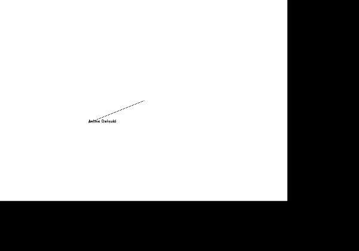
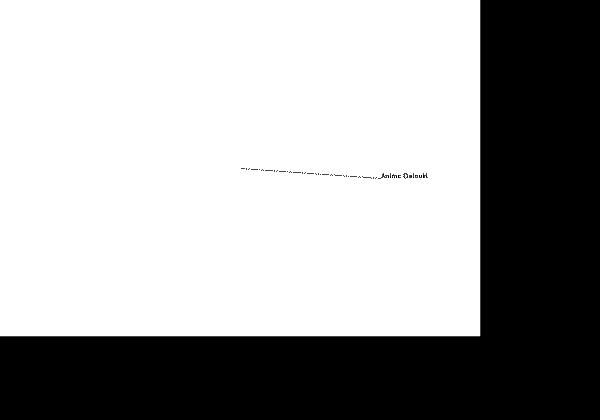

# 魔改一下LibGraphics

[toc]

## 减少闪烁

使用LibGraphics，令人最诟病的就是播放动画时的闪烁问题。

### 例子程序

以下是本节使用的例子程序。程序将绘制一个沿椭圆轨迹运动的字符串、以及一条从椭圆中心到字符串的直线段。

- 将**graphics.c**中定义而**graphics.h**未声明的**startTimer**函数提取到**graphics.h**中。

  - graphics.h中的修改：

```c
// +
void startTimer(int id, int timeinterval);
```

- 在**main.c**中输入如下代码：


```c
#include "libgraphics/extgraph.h"

#include <math.h>

void timerCallback(int timerID)
{
	static int angle = 0;
	double windowSize[2] = { GetWindowWidth(), GetWindowHeight() };
	double center[2] = { windowSize[0] / 2, windowSize[1] / 2 };
	// 清屏
	SetPenColor("WHITE");
	MovePen(0, 0);
	StartFilledRegion(1.0);
	DrawLine(windowSize[0], 0);
	DrawLine(0, windowSize[1]);
	DrawLine(-windowSize[0], 0);
	DrawLine(0, -windowSize[1]);
	EndFilledRegion();
	// 画椭圆
#define PI 3.1415926
#define RADIUS_X 3.0
#define RADIUS_Y 1.0
	double dx = RADIUS_X * cos(PI * angle / 180.0);
	double dy = RADIUS_Y * sin(PI * angle / 180.0);
#undef RADIUS_Y
#undef RADIUS_X
#undef PI
	SetPenColor("BLACK");
	MovePen(center[0], center[1]);
	DrawLine(dx, dy);
	// 画文字
	MovePen(center[0] + dx, center[1] + dy);
	DrawTextString("Anime Daisuki");
	// 角度参数时变
	++angle;
	if (angle == 360) angle = 0;
}

void Main()
{
	InitGraphics();
	SetWindowTitle("Anime LibGraphics");
	registerTimerEvent(timerCallback);
	// 15ms为周期，近似于60FPS
	startTimer(0, 15);
}
```

- 得到如下**闪烁**的效果：




### LibGraphics的绘制逻辑

要解决这个问题，有必要搞清楚**LibGraphics**如何调用WIN32的API（一个由Windows提供的系统服务接口，包括窗口的创建、绘制、输入处理等）。

- 最先引起我们兴趣的，当然是**LibGraphics**这个奇怪的入口函数**Main**。

```c
void Main() {}
```

- 众所周知，一般C程序的入口函数是**main**。

```c
int main(int argc, char** argv) {}
```

- 众所周知，WIN32程序的入口函数是**WinMain**

```c
int WINAPI WinMain (HINSTANCE hThisInstance,
                    HINSTANCE hPrevInstance,
                    LPSTR lpszArgument,
                    int nFunsterStil)
```

- 但这里的**Main**既不是**main**也不是**WinMain**。对它按Ctrl+F12查看函数声明，发现**Main**被声明于**graphics.h**之中。
- 继续 对**Main**右键，点击 查看调用层次结构，发现它在**graphics.c**的**WinMain**函数中被调用。
  - 至此，终于找到程序入口点**WinMain**！

```c
int WINAPI WinMain (HINSTANCE hThisInstance,
                    HINSTANCE hPrevInstance,
                    LPSTR lpszArgument,
                    int nFunsterStil)

{
    MSG messages;            /* Here messages to the application are saved */
    
    Main();
    
    /* Run the message loop. It will run until GetMessage() returns 0 */
    while (GetMessage (&messages, NULL, 0, 0))
    {
        /* Translate virtual-key messages into character messages */
        TranslateMessage(&messages);
        /* Send message to WindowProcedure */
        DispatchMessage(&messages);
    }
    FreeConsole();
    return messages.wParam;
}
```

- 根据[Get Started with Win32 and C++ - Win32 apps | Microsoft Docs](https://docs.microsoft.com/en-us/windows/win32/learnwin32/learn-to-program-for-windows)，**WinMain**函数只负责对窗口进行初始化，实际的绘制、事件响应逻辑（又称**消息循环**）应该藏在**WNDCLASS (Window Class)对象**被赋予的**lpfnWndProc成员**中。
- 接下来我们要找到那个控制绘制、输入处理的**消息循环**。
  - 寻找过程如下：

```c
// graphics.c
int WINAPI WinMain (HINSTANCE hThisInstance,
                    HINSTANCE hPrevInstance,
                    LPSTR lpszArgument,
                    int nFunsterStil)

{
    MSG messages;            /* Here messages to the application are saved */
    
    // 因为WinMain()中并未创建并绑定WNDCLASS对象，推测该过程发生在Main()中
    Main(); // 对它【按F12】
    // ...
}
// ||
// \/
// main.c
void Main()
{
	InitGraphics(); // 对它【按F12】
	SetWindowTitle("Anime LibGraphics");
	registerTimerEvent(timerCallback);
	// 15ms为周期，近似于60FPS
	startTimer(0, 15);
}
// ||
// \/
// graphics.c
void InitGraphics(void)
{
    if (!initialized) {
        initialized = TRUE;
        ProtectVariable(stateStack);
        ProtectVariable(windowTitle);
        ProtectVariable(textFont);
        InitColors();
        InitDisplay(); // 对它【按F12】
    }
    DisplayClear();
    InitGraphicsState();
}
// ||
// \/
// graphics.c
static void InitDisplay(void)
{
    // ......
    wndcls.hInstance = NULL;
    // GraphicsEventProc就是消息循环的回调函数了，对GraphicsEventProc【按F12】
    wndcls.lpfnWndProc = GraphicsEventProc;
    wndcls.lpszClassName = "Graphics Window";
    // ......
}
// ||
// \/
// graphics.c
static LONG FAR PASCAL GraphicsEventProc(HWND hwnd, UINT msg,
                                         WPARAM wParam, LPARAM lParam)
{
    switch(msg)
    {
        case WM_PAINT:
             DoUpdate(); // 对它【按F12】
             return 0;
             
        // ...
        case WM_KEYDOWN:
        // ...
        case WM_LBUTTONDOWN:
        // ...
        case WM_TIMER:
	        if (g_timer != NULL)
                // 有心的同学应该能发现，
                //   经过main.c Main()的registerTimerEvent()之后，
                //   这个g_timer函数指针指向了main.c里的timerCallback函数。
                // 定时动画的逻辑就是这么实现的！
    			g_timer(wParam);
    		return 0;
        // ...
    }
    // ...
}
```

- **GraphicsEventProc**函数就是我们的消息循环。
- 不难看出，在收到**WM_PAINT**事件（消息）时，程序会调用**DoUpdate**函数去更新画面。
  - 其他事件控制逻辑也同理。在本例中我们还使用了**WM_TIMER**事件（消息），有兴趣的同学可以自己再探究。

- 进入**DoUpdate**函数，发现**LibGraphics**使用了**双缓冲技术**。<span id="doubleBuffer"></span>
  - 窗口使用的是**句柄**为**dc**的缓冲，改变这个内存里的缓冲就能改变屏幕内容。
    - **句柄**这个翻译实在是那啥|(*′口`)！反正就理解成一个**对象**拥有的**唯一的ID**。通过这个**ID**就能在内存里找到这个**对象**。
      - 换言之，**dc**就是窗口的**ID**。
    - 至于**对象**，就暂时理解成一个 C结构体 的 变量 吧。
  - 而**DrawLine**、**DrawCircle**等函数改变的是**句柄**为**osdc (Offscreen Device Context) **的缓冲。
    - 在调用**DoUpdate**函数之前，不管你调用多少个**DrawXXX**函数，都不会改变窗口显示的内容。
    - 但调用了**DoUpdate**函数之后，**osdc**的内容会被**BitBlt**函数复制到**dc**里，刷新窗口显示的内容。
  - 这样做的好处就是：屏幕是一整个一起更新的，不是一块一块顺序更新的，避免了新旧内容混合的问题。

```c
// graphics.c
static void DoUpdate(void)
{
    HDC dc;

    dc = BeginPaint(graphicsWindow, &ps);
    BitBlt(dc, 0, 0, pixelWidth, pixelHeight, osdc, 0, 0, SRCCOPY);
    EndPaint(graphicsWindow, &ps);
}
```

### 解决问题

既然**LibGraphics**已经使用了**双缓冲**技术，避免了新旧内容混合导致的闪烁，那动画的闪烁到底是怎么回事呢？

- **BitBlt**函数被调用时，**osdc**的内容是一次性复制给**dc**的，因此此步骤不可能引发闪烁。

- 在**BitBlt**函数之前，还有一个**BeginPaint**函数。根据[BeginPaint function (winuser.h) - Win32 apps | Microsoft Docs](https://docs.microsoft.com/en-us/windows/win32/api/winuser/nf-winuser-beginpaint)的描述：

  - > The update region is set by the [InvalidateRect](https://docs.microsoft.com/en-us/windows/desktop/api/winuser/nf-winuser-invalidaterect) or [InvalidateRgn](https://docs.microsoft.com/en-us/windows/desktop/api/winuser/nf-winuser-invalidatergn) function and by the system after sizing, moving, creating, scrolling, or any other operation that affects the client area. If the update region is marked for erasing, **BeginPaint** sends a **WM_ERASEBKGND** message to the window.

  - 也就是说，**BeginPaint**函数会依据之前调用的**InvalidateRect**函数确定一块**需要更新的区域**。若此块区域被**标记为需要擦除**，则**BeginPaint**会向事件（消息）循环发送一个**WM_ERASEBKGND**事件（消息）。

- 而在我们的消息循环**GraphicsEventProc**函数中，**WM_ERASEBKGND**被归类为**Default Cases**，扔给默认消息循环**DefWindowProc**函数去处理。

```c
// graphics.c
static LONG FAR PASCAL GraphicsEventProc(HWND hwnd, UINT msg,
                                         WPARAM wParam, LPARAM lParam)
{
    switch(msg)
    {
        // ... 前面并没有case WM_ERASEBKGND:
        default:
            return DefWindowProc(hwnd, msg, wParam, lParam);
    }   
    // ...
}
```

- 根据[WM_ERASEBKGND message (Winuser.h) - Win32 apps | Microsoft Docs](https://docs.microsoft.com/en-us/windows/win32/winmsg/wm-erasebkgnd)的描述：

  - > The [**DefWindowProc**](https://docs.microsoft.com/en-us/windows/desktop/api/winuser/nf-winuser-defwindowproca) function erases the background by using the class background brush specified by the **hbrBackground** member of the [**WNDCLASS**](https://docs.microsoft.com/en-us/windows/win32/api/winuser/ns-winuser-wndclassa) structure.

  - 也就是说，**DefWindowProc**函数收到**WM_ERASEBKGND**后，会把画面刷白一次。这就是**闪烁的原因**。

- 要解决这个问题，有多种方法。

- 方法一非常偷懒：

  - 不把**WM_ERASEBKGND**事件（消息）交给**DefWindowProc**函数处理即可。这就是**事件过滤**（Doge）。

```c
// graphics.c
static LONG FAR PASCAL GraphicsEventProc(HWND hwnd, UINT msg,
                                         WPARAM wParam, LPARAM lParam)
{
    switch(msg)
    {
        // ...
        // +
        case WM_ERASEBKGND:
            // 这里返回0，是 https://docs.microsoft.com/en-us/windows/win32/winmsg/wm-erasebkgnd 的要求
            return 0;
        default:
            return DefWindowProc(hwnd, msg, wParam, lParam);
    }   
    // ...
}
```

- 方法二比较麻烦：
  - 将**graphics.c**中所有**InvalidateRect**函数的最后一个参数设为**FALSE**。这样就不会把需要更新的区域**标记为需要擦除**。
- 当然，以上修改可能会导致其他bug，但至少目前是能用了。



