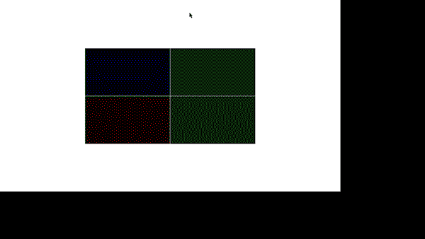

# 魔改一下LibGraphics

[toc]

## 操作像素

做到这里，你的**LibGraphics**已经可以胜任大多数C大程项目了。但为了方便地画出三维图形，还是得再改一改。

**LibGraphics**本身只是对**Win32 API**的封装，即使是非常基本的图形操作，都要调用**Win32**对应的接口。

- **LibGraphics**的**DrawLine**函数，最终调用了**Win32**的**LineTo**函数。

```c
// graphics.c
void DrawLine(double dx, double dy)
{ 
    // ... 
}
// ||
// \/
static void DisplayLine(double x, double y, double dx, double dy)
{
    // ...
    if (regionState == NoRegion) {
		// ...
        LineTo(osdc, x1, y1); // 【属于Win32系列】
    } else {
        AddSegment(x0, y0, x1, y1);
    }
}
```

但我们要实现的**软3D渲染流程**希望尽可能地用CPU去模拟GPU的工作过程，因此**操作 帧缓冲（Frame Buffer） 以 操作 屏幕内容（物理意义，比如你的显示屏）**这个概念是必要的。

说白了就是要操作窗口中的像素。我们可以用**Win32**的**HBITMAP结构**，以操作内存的方式操作osdc[（忘记osdc的作用请点击此链接）](./ModifyLibGraphics-NoBlink.md#doubleBuffer)。

操作内存就是模拟操作帧缓冲，操作窗口内容就是模拟操作屏幕内容。

### 修改LibGraphics 与 编写LibGraphics3D库

- 在项目根目录中新建**libg3D**文件夹。
- 在 VS 2019 - 解决方案资源管理器 - \<项目名\>/源文件 中，添加一个**筛选器**（就是虚拟的文件夹），命名为**libg3D**。
- 在**libg3D**文件夹中添加**graphics3D.h**和**graphics3D.c**文件，并将**graphics3D.c**添加到 \<项目名\>/源文件/libg3D 中。
- 在**libgraphics**文件夹中添加**win32Export.h**。
  - 这个的作用后面再讲。
- 至此，磁盘中的项目根目录如下：

```
+ <项目名>
|__+ libragphics
|  |__ win32Export.h 
|  |__ graphics.h
|  |__ graphics.c
|  |__ ...
|__+ libg3D
|  |__ graphics3D.h
|  |__ graphics3D.c
|__ main.c
|__ <项目名>.sln
|__ <项目名>.vcxproj
|__ ...
```

- VS 2019中的解决方案资源管理器如下：

```
+ <项目名>
|__+ 头文件
|__+ 源文件
|  |__ main.c
|  |__+ libgraphics
|  |  |__ graphics.c
|  |  |__ genlib.c
|  |  |__ ...
|  |__+ libg3D
|     |__ graphics3D.c
|__ ...
```

- 在**graphics3D.h**中声明以下接口：

```c
#ifndef _GRAPHICS3D_H
#define _GRAPHICS3D_H

// 底层图形组件
enum LIBG3D_PRIMITIVE
{
	LIBG3D_POINTS,
	LIBG3D_LINES,
	LIBG3D_TRIANGLES
};

// 错误码
enum LIBG3D_ERROR
{
	LIBG3D_NO_ERR,
	LIBG3D_ILLEGAL_VAL,
	LIBG3D_NULL_MVP_MAT
};

/// <summary>
/// 获取窗口宽度，以像素为单位，而不是LibGraphics那个奇怪的double类型数值
/// </summary>
/// <returns>窗口宽度（以像素为单位）</returns>
int libg3DGetWindowPixelWidth();

/// <summary>
/// 获取窗口高度，以像素为单位，而不是LibGraphics那个奇怪的double类型数值
/// </summary>
/// <returns>窗口高度（以像素为单位）</returns>
int libg3DGetWindowPixelHeight();

/// <summary>
/// 设置当前视口尺寸
/// </summary>
/// <param name="x">距离窗口左下的横坐标</param>
/// <param name="y">距离窗口左下的纵坐标</param>
/// <param name="width">宽度</param>
/// <param name="height">高度</param>
void libg3DViewport(int x, int y, int width, int height);

/// <summary>
/// 使用某个颜色填充视口
/// </summary>
/// <param name="r">红</param>
/// <param name="g">绿</param>
/// <param name="b">蓝</param>
void libg3DClearWithColor(float r, float g, float b);

#endif // !_GRAPHICS3D_H
```

- 要在**graphics3D.c**实现上面的接口，我们需要一个与**osdc**绑定的**HBITMAP结构**。但如你所见**osdc**是**graphics.c**的静态全局变量，不能在**graphics3D.c**中访问。

```c
// graphics.c
// ...
static HWND consoleWindow, graphicsWindow;
static HDC gdc, osdc; // 静态全局变量
static HBITMAP osBits;
static HPEN drawPen, erasePen, nullPen;
// ...
```

- 要解决这个问题，有多种方法。

- 方法一是把**静态全局的osdc**修改成**全局osdc**，再在**graphics3D.c**中用**extern**关键字声明一个**osdc**。

- 方法二看起来更加中二（Doge），我们就用方法二：

  - 鲁迅说过：

    - > 如果一个软件工程问题不能靠加一层封装来解决，那就加两层！

  - 现在的**LibGraphics**和**LibGraphcis3D**是这样的：

```
-----+------------------------------------
应用层| main.c ------------+
-----+---|---------------+-\--------------
     |  \|/              | _\|
接口层| extgraph.h        | graphgics3D.h
-----+---|---------------+---|------------
     |   |               |   |
     |  \|/              |  \|/
实现层| graphics.c (osdc) | graphics3D.c
-----+-------------------+----------------
```

- - 我们给它加一层：

```
-----+--------------------------------------
应用层| main.c --------------+
-----+---|-----------------+-\--------------
     |  \|/                | _\|
接口层| extgraph.h          | graphgics3D.h
-----+---|-----------------+---|------------
     |   |                     |
共享层|   | win32Export.h<------|------+
-----+---|----------|------+---|------|----
     |   |          |      |   |      |
     |  \|/        \|/     |  \|/     |
实现层| graphics.c (osdc)   | graphics3D.c
-----+---------------------+----------------
```

- - 通过**共享层的win32Export.h**，把**graphics.c**里面的**部分Win32变量**暴露出来。
    - 避免**全局变量**可能造成的命名混乱：比如存在多个**osdc**的问题（毕竟这是个很常见的名字）。
    - 避免**内部数据**被暴露给**应用层**：比如让**graphics3D.c**直接**include extgraph.h**，通过**extgraph.h**共享数据。这样将导致**main.c**也可以访问**osdc**，给了用户乱搞的自由。
    - 其他好处编不下去了。。。
  - **win32Export.h**与其函数的实现如下：

```c
// win32Export.h
#ifndef _WIN32_EXPORT_H
#define _WIN32_EXPORT_H

#include <Windows.h>

// 用于调用InvalidateRect()
HWND GetLibgWindow();

// 用于创建HBITMAP
HDC GetLibgOSDC();

// 用于libg3DGetWindowPixelWidth()
int GetLibgWindowPixelWidth();

// 用于libg3DGetWindowPixelHeight()
int GetLibgWindowPixelHeight();

#endif // !_WIN32_EXPORT_H

// graphics.c
// +
HWND GetLibgWindow() { return graphicsWindow; }

HDC GetLibgOSDC() { return osdc; }

int GetLibgWindowPixelWidth() { return pixelWidth; }

int GetLibgWindowPixelHeight() { return pixelHeight; }
```

- 终于，我们可以在**graphics3D.c**中实现**graphics3D.h**的接口了：

```c
#include "graphics3D.h"
#include "../libgraphics/win32Export.h"

// WIN32元素
static HBITMAP oldBitmap = NULL, bitmap = NULL;

// 帧缓冲结构
//   一个窗口就由一个帧缓冲操控。
struct FrameBuffer
{
	int windowW, windowH; // 窗口大小
	int viewportX, viewportY; // 视口距离窗口左下角的偏移
	int viewportW, viewportH; // 视口大小
	unsigned char* colorAttachment; // 帧缓冲的颜色缓冲（还有其他缓冲，后面再说）
};

static struct FrameBuffer frameBuffer = { 0 };

int libg3DGetWindowPixelWidth()
{
	return GetLibgWindowPixelWidth();
}
int libg3DGetWindowPixelHeight()
{
	return GetLibgWindowPixelHeight();
}

void libg3DViewport(int x, int y, int width, int height)
{
	// 保证初始化只进行一次
	if (frameBuffer.colorAttachment == NULL)
	{
		// 获取graphics.c创建的窗口尺寸
		frameBuffer.windowW = GetLibgWindowPixelWidth();
		frameBuffer.windowH = GetLibgWindowPixelHeight();
		// 新建一个与osdc适配的bitmap对象，
		// BITMAPINFO 详见 https://docs.microsoft.com/en-us/windows/win32/api/wingdi/ns-wingdi-bitmapinfo
		BITMAPINFO bitmapInfo = { {
				sizeof(BITMAPINFOHEADER),
				frameBuffer.windowW, frameBuffer.windowH,
				1,
				32, // 一个像素占4个byte，32个bit
				BI_RGB,
				frameBuffer.windowW * frameBuffer.windowH * 4,
				0, 0, 0, 0
			}
		};
		LPVOID ptr = NULL;
		bitmap = CreateDIBSection(GetLibgOSDC(), &bitmapInfo, DIB_RGB_COLORS, &ptr, 0, 0);
		// 将bitmap设置为当前osdc的bitmap，操作bitmap即操作osdc
		oldBitmap = (HBITMAP)SelectObject(GetLibgOSDC(), bitmap);
		// 将frameBuffer的colorAttachment指向ptr，操作frameBuffer即操作bitmap
		frameBuffer.colorAttachment = (unsigned char*)ptr;
		frameBuffer.viewportH = frameBuffer.windowH;
		frameBuffer.viewportW = frameBuffer.windowW;
	}

	// 改变frameBuffer的viewport相关变量
	//   各种边界检查
	frameBuffer.viewportX = x < 0 ? 0 : x;
	frameBuffer.viewportX = frameBuffer.viewportX >= frameBuffer.windowW - 1
		? frameBuffer.windowW - 1 : frameBuffer.viewportX;
	frameBuffer.viewportY = y < 0 ? 0 : y;
	frameBuffer.viewportY = frameBuffer.viewportY >= frameBuffer.windowH - 1
		? frameBuffer.windowH - 1 : frameBuffer.viewportY;
	int tmp;
	tmp = frameBuffer.viewportX + width;
	frameBuffer.viewportW = (tmp > frameBuffer.windowW ? frameBuffer.windowW : tmp)
		- frameBuffer.viewportX;
	tmp = frameBuffer.viewportY + height;
	frameBuffer.viewportH = (tmp > frameBuffer.windowH ? frameBuffer.windowH : tmp)
		- frameBuffer.viewportY;
}

void libg3DClearWithColor(unsigned char r, unsigned char g, unsigned char b)
{
	// 步长，每跨一步相当于往上一行
	int stride = frameBuffer.windowW * 4;
	// 行起始指针，指向当前viewport 第N行 的 第一个像素
	unsigned char* rowPtr = frameBuffer.colorAttachment
		+ frameBuffer.viewportY * stride
		+ frameBuffer.viewportX * 4;
	for (int row = 0; row < frameBuffer.viewportH; ++row)
	{
		// 像素起始指针，指向 rowPtr所在行 的 第N个 像素
		unsigned char* pixPtr = rowPtr;
		for (int col = 0; col < frameBuffer.viewportW; ++col)
		{
			// 逐像素赋颜色值
			// 注意：WIN32的BITMAP采用BGRA布局，而不是RGBA
			//   一个像素占4个byte，32个bit
			pixPtr[0] = b;
			pixPtr[1] = g;
			pixPtr[2] = r;
			pixPtr[3] = 255; // 透明度满格

			pixPtr += 4; // 往右一列
		}
		rowPtr += stride; // 往上一行
	}

	// 将整个viewport标记为需要更新（不是需要擦除）
	{
		// 注意：viewportRECT使用Win32坐标系，
		//   y轴反向，同时原点在窗口左上角
		RECT viewportRECT = {
		frameBuffer.viewportX, // 左
		frameBuffer.windowH - frameBuffer.viewportY - frameBuffer.viewportH, // 上
		frameBuffer.viewportX + frameBuffer.viewportW, // 右
		frameBuffer.windowH - frameBuffer.viewportY // 下
		};
		InvalidateRect(GetLibgWindow(), &viewportRECT, FALSE); // FALSE注意！
	}
}
```

### 例子程序

- 在**main.c**中输入如下代码：

```c
#include <string.h>

#include "libgraphics/extgraph.h"
#include "libg3D/graphics3D.h"

#include <math.h>

void timerCallback(int timerID)
{
	static unsigned char color = 0;
	static char increase = 1;

	// 划出一个小的范围（视口）用于显示3D内容
	int windowW = libg3DGetWindowPixelWidth();
	int windowH = libg3DGetWindowPixelHeight();
	int viewportW = windowW / 4;
	int viewportH = windowH / 4;
	// 左下 四分之一，显示红色
	libg3DViewport(windowW / 4, windowH / 4, viewportW, viewportH);
	libg3DClearWithColor(color, 0, 0);
	// 右下 四分之一，显示绿色
	libg3DViewport(windowW / 2, windowH / 4, viewportW, viewportH);
	libg3DClearWithColor(0, color, 0);
	// 左上 四分之一，显示蓝色
	libg3DViewport(windowW / 4, windowH / 2, viewportW, viewportH);
	libg3DClearWithColor(0, 0, color);
	// 右上 四分之一，显示白色（灰色）
	libg3DViewport(windowW / 2, windowH / 2, viewportW, viewportH);
	libg3DClearWithColor(color, color, color);

	// 参数时变
	if (increase == 1) ++color;
	else color--;

	if (color == 255) increase = 0;
	else if (color == 0) increase = 1;
}

void Main()
{
	// 设置全屏
	double w = GetFullScreenWidth();
	double h = GetFullScreenHeight();
	SetWindowSize(w, h);

	InitGraphics();
	SetWindowTitle("3D Viewport LibGraphics");
	registerTimerEvent(timerCallback);
	// 15ms为周期，近似于60FPS
	startTimer(0, 15);
}
```

- 最终结果如下：


